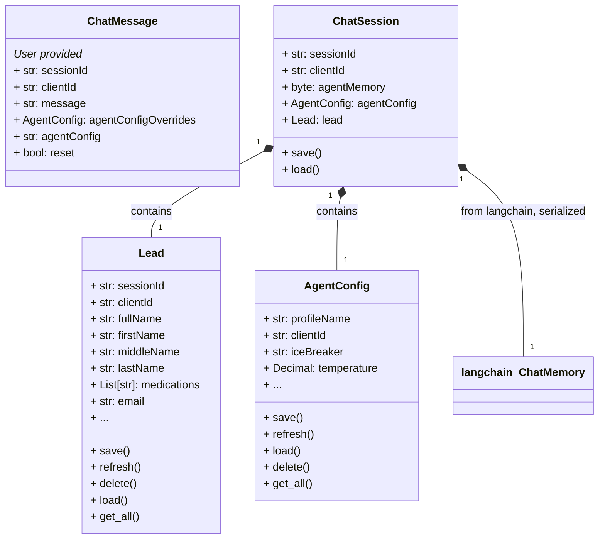
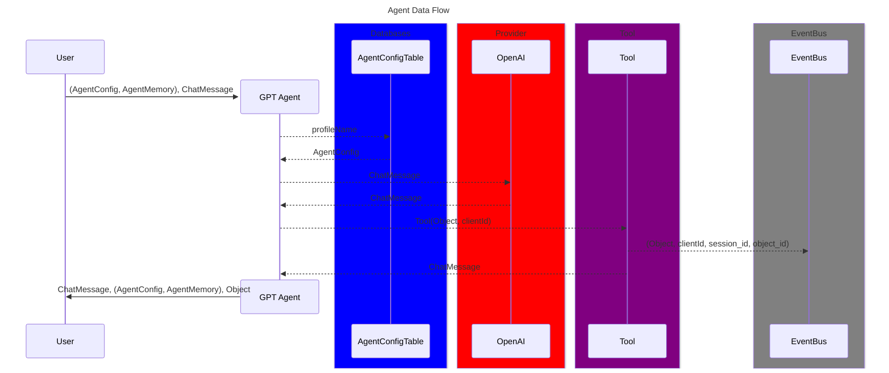
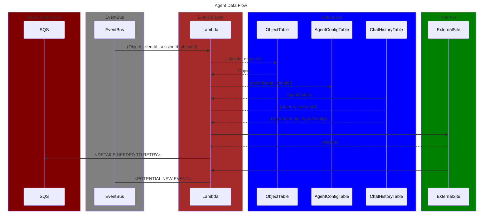

# OpenBrain


🚧 **Under active development. Not ready for use.** 🚧

OpenBrain is a chat platform backed by Large Language Model (LLM) agents. It provides APIs and tools to configure, store, and retrieve chat agents, making your chat sessions more versatile and context-aware.

OpenBrain agents are stateful, so they can remember things about you and your conversation. They can also use tools, so you can use the same agent to chat and to perform actions.

Interactions with the agent can be injected into any application easily by constructing a query, choosing an agent configuration, and pre-processing your data through that agent before sending it of for further processing.

## Features

- **Interactive Agent Tuner**: A GUI to modify and test agent configurations.
- **Command-Line Interface**: Use `ob` for quick completions and `ob-chat` for an interactive session.
- **Flexible Configuration**: Customizable agents through DynamoDB backed ORM.
- **Event-Driven Architecture**: Extensible through cloud-based event handling.

## Quick Start
### Installation


```bash
pip install openbrain
```

### Setup .env file
```bash
cp .env.example .env  # Edit this file with your own values
```
### Deploy Supporting Infrastructure
```bash
python ci_cd.py -I
```

## Using OpenBrain

### OpenBrain Gradio Tuner
To facilitate tuning agent parameters and experimenting with prompts, OpenBrain provides a GUI interface using Gradio. To launch the GUI.


```bash
$ ob-tuner
Running on local URL:  http://0.0.0.0:7861

To create a public link, set `share=True` in `launch()`.
Tip: You can show or hide the button for flagging with the `allow_flagging=` kwarg; for example: gr.Interface(..., allow_flagging=False)
```

### Command Line Completions

```bash
$ ob "What is the air speed velocity of an unladen swallow?" -v

> Entering new AgentExecutor chain...
Ah, the famous question about the air speed velocity of an unladen swallow. Are you referring to an African or European swallow?

> Finished chain.
Ah, the famous question about the air speed velocity of an unladen swallow. Are you referring to an African or European swallow?
```

### Command Line Interactive Session

```bash
$ ob-chat
---------- Begin Chat Session ----------
> OpenBrain: What… is your name?
User: It is Arthur – King of the Britons.
> OpenBrain: What… is your quest?
User: To seek the Holy Grail.
> OpenBrain: What… is the air-speed velocity of an unladen swallow?
User: What do you mean? An African or a European swallow?
> OpenBrain: I don’t know that. Aaaaaaaaagh!
```

## Architecture Overview

### Data Model



# Data Flow diagram
OpenBrain uses an event driven architecture. The agent sends events to event bus and then the developer can simply write rules and targets for the incoming events once the targets are ready. The following diagram shows the data flow in two parts.
1. The user interaction with the agent and the agent interaction with an event bus.
2. The event bus and the targets that are triggered by the events.




## Contributing

See [CONTRIBUTING.md](CONTRIBUTING.md) for guidelines.

## License

- **Open Source**: AGPL-3.0, see [LICENSE](LICENSE)
- **Commercial**: See [COMMERCIAL_LICENSE](COMMERCIAL_LICENSE) and contact us for inquiries.
