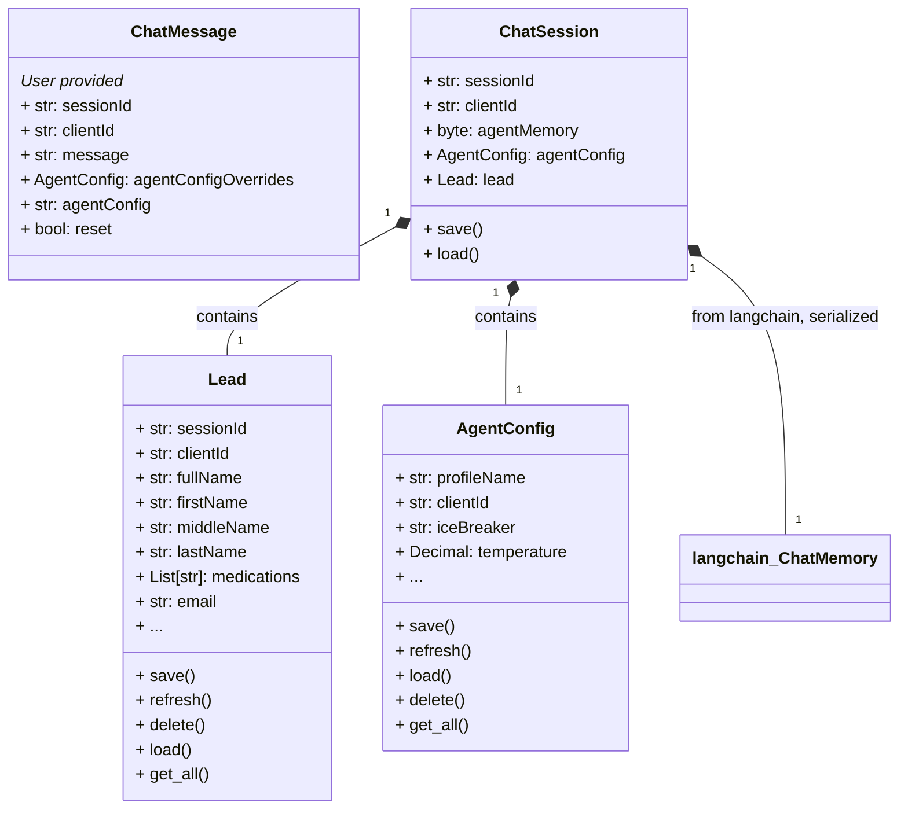
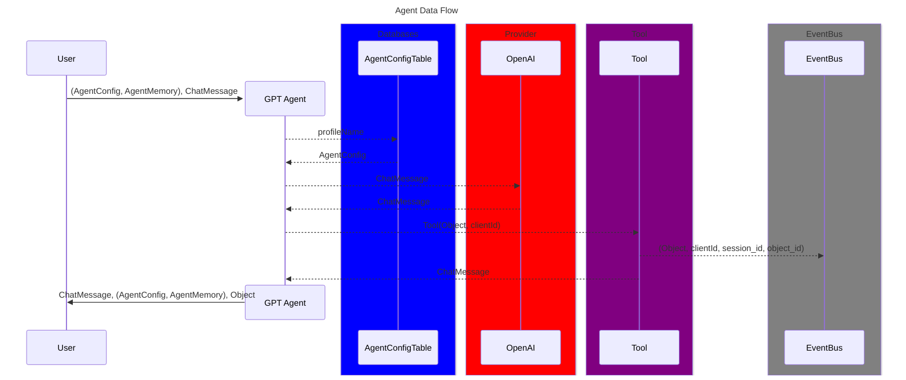
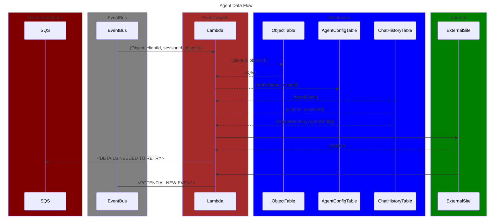

# OpenBra.in

🚧 **This project is under active development and is not yet ready for use.** 🚧


A tool to store and retrieve sets of langchain LLM agent parameters for use in chat sessions. Allows users to chat with a programatically configurable, stateful LLM agent. An ORM is provided using DynamoDB to aid in the storage and retrieval of agent parameters, sessions, agent parameters, agent memories, and more.

## Ways ot interact with OpenBra.in

OpenBrain uses tools, so any of the methods of interacting with the agent is capable of launching tool actions. For example, you can use the `ob` command-line utility to get a simple completion, but your prompt may trigger the use of a tool, making the single completion much more interesting.

### OpenBrain Tuner
Save, load, and modify agent configurations in DynamoDB. Use the included, self-hosted gradio UI to chat with the agent and interactively create your prompts and configurations.
The following commands are available for use in the shell.

```bash
$ ob-tuner
Running on local URL:  http://0.0.0.0:7861

To create a public link, set `share=True` in `launch()`.
Tip: You can show or hide the button for flagging with the `allow_flagging=` kwarg; for example: gr.Interface(..., allow_flagging=False)
```


### OpenBrain ad-hoc command-line completions
Use `ob` command for one-off completions by the agent.

```bash
$ ob "What is the airspeed velocity of an unladen swallow?" 
> OpenBrain: "African or European?"
```
### OpenBrain interactive, command line chat
Use the `oc-chat` command to start an interactive chat session with the agent on the command line.

```
$ ob-chat
---------- Begin Chat Session ----------
> OpenBrain: What… is your name?
User: It is Arthur – King of the Britons.
> OpenBrain: What… is your quest?
User: To seek the Holy Grail.
> OpenBrain: What… is the air-speed velocity of an unladen swallow?
User: What do you mean? An African or a European swallow?
> OpenBrain: I don’t know that. Aaaaaaaaagh!
```

## OpenBrain Central Infrastructure
In order to realize the full benefit of this project, you must deploy the central infrastructure. This is a serverless stack that provides the following:


```bash
pipenv run build
```

Alternatively, you can run the following to build and deploy:

```bash
sam build 
sam deploy --guided
```
## Object Model - High level summary
Details subject to change. See OpenAPI spec for latest details.

### ChatMessage Object

#### Fields:

- **sessionId**: Used if sessions are not working correctly using headers.
- **clientId**: Used to identify the user client. The client is the user that deploys the chat widget with their API
  key.

- **reset**:
    - If `True`, the session is reset and an Optional AgentConfig is used to start a new session. A default is used if
      no AgentConfig is provided.
    - If `False`, the session is continued and a response to **message** is returned. If `None`, the session is started.
- **message**: The message sent by the user. Only considered during requests to chat (`reset == False`).
- **agentConfig**: The AgentConfig object used to customize the chat session. Only considered during requests to
  chat (`reset == True`).

```json 
{
    "sessionId": "OPTIONAL",
    "clientId": "OPTIONAL",
    "message": "OPTIONAL",
    "agentConfigOverrides": { "AgentConfig": "OPTIONAL" },
    "reset": "OPTIONAL"
}
``` 

## AgentConfig Object

Used to customize a chat session by configuring LLM options such as system message, temperature, and model. Also allows
for the use of saved configurations and a combination of saved and custom configurations.

```json
{
    "profileName": "REQUIRED",
    "clientId": "REQUIRED",
    "systemMessage": "OPTIONAL",
    "iceBreaker": "OPTIONAL",
    "...": "..."
}
```

# Data Model

The API uses a "dirty" sessions table to store agent memories and configurations. The chat session object is composed of
the following.



# Data Flow diagram
We use a decoupled, event driven architecture. The agent sends events to event bus and then the developer can simply write rules and targets for the incoming events once the targets are ready. The following diagram shows the data flow in two parts. 
1. The user interaction with the agent and the agent interaction with an event bus.
2. The event bus and the targets that are triggered by the events.




## Deployment (CI/CD)
All devops procedures are codified in `ci_cd.py` to run cross-platform, and the commands are ultimately available as
simple pipenv scripts.

```
# python ci_cd.py --help  
usage: ci_cd.py [-h] [--dry-run] [--verbose] [--print-central-infra-outputs] [--stage {dev,prod}] [--test-python] [--skip-tests] [--skip-build] [--build-python] [--publish-python] [--deploy-infra]

Utility script for deployment of python packages and supporting infrastructure.

options:
  -h, --help            show this help message and exit
  --dry-run, -d         Prevents any changes from being made.
  --verbose, -v         Logs debug messages.
  --print-central-infra-outputs, -p
                        Prints the central infrastructure outputs as they currently exist.
  --stage {dev,prod}, -s {dev,prod}
                        If 'dev', publish to pypi-test, if 'prod', publish to pypi.
  --test-python, -t     Run pytest tests
  --skip-tests          Skip pytest tests
  --skip-build          Skip poetry build commands
  --build-python, -B    Run poetry build commands in an idempotent manner.
  --publish-python, -P  Publish python using poetry
  --deploy-infra, -I    Deploy the central infrastructure stack
```

## License

This project is dual-licensed.

1. For open-source projects and educational purposes, it is available under the AGPL-3.0 License. See [LICENSE](LICENSE) for details.
  
2. For commercial projects, a separate license is available. See [COMMERCIAL_LICENSE](COMMERCIAL_LICENSE) for details and contact [Your Contact Information] for inquiries.
