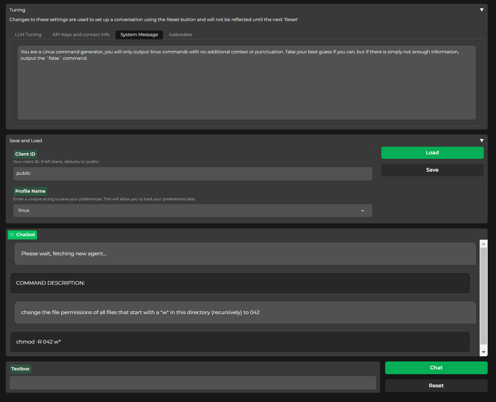
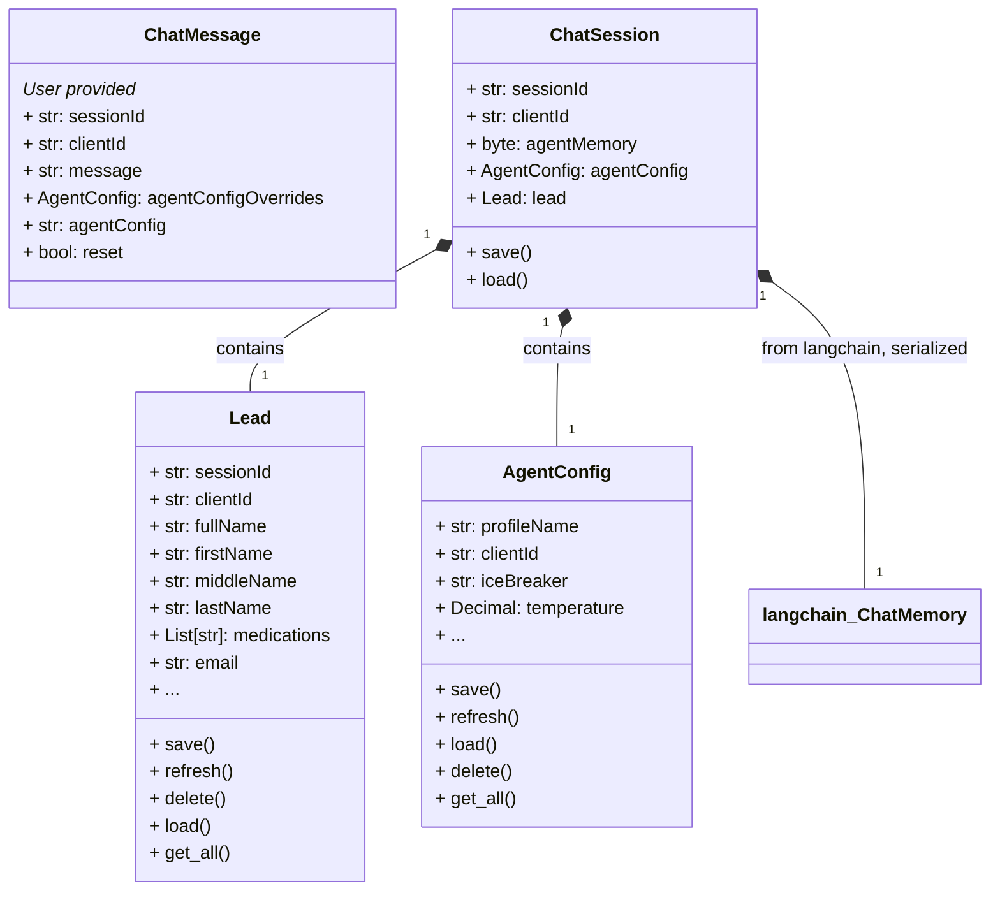
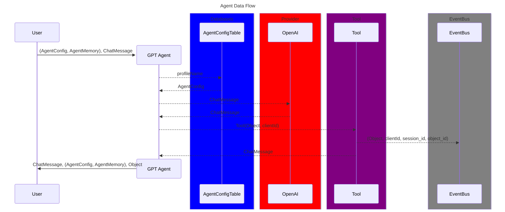
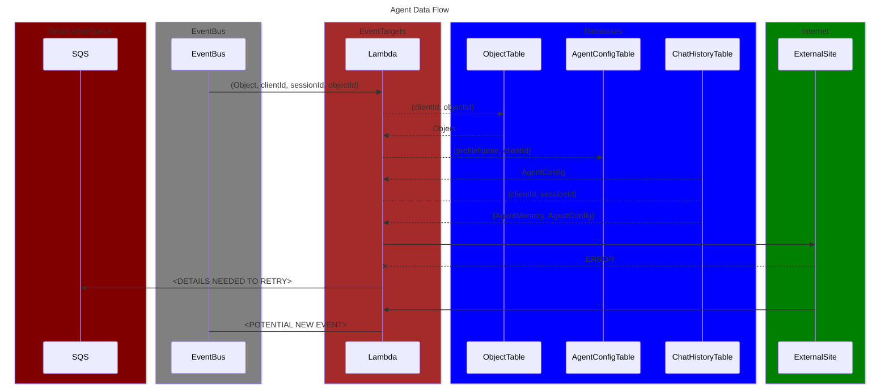

# OpenBrain


[](https://www.gnu.org/licenses/agpl-3.0)[](https://github.com/astral-sh/ruff)
<a href="https://github.com/psf/black"></a>
[](https://conventionalcommits.org)
[](https://github.com/pre-commit/pre-commit)
[](https://github.com/features/actions "Go to GitHub Actions homepage")
[](https://github.com/semantic-release/semantic-release)

[//]: # (![CI]&#40;https://github.com/svange/openbrain/actions/workflows/publish-release.yml/badge.svg&#41;)

[//]: # (![Tests]&#40;https://github.com/svange/openbrain/actions/workflows/run-tests.yml/badge.svg&#41;)

[//]: # (![CI &#40;pre-release&#41;]&#40;https://github.com/svange/openbrain/actions/workflows/publish-prerelease.yml/badge.svg&#41;)

[//]: # (![CD &#40;staging&#41;]&#40;https://github.com/svange/openbrain/actions/workflows/deploy-dev.yml/badge.svg&#41;)


🚧 **Under active development, expect instability until v1 (targeting Jan).** 🚧

## Links

---
> **NOTE**: The following links demonstrate resources that are works in progress, these are the main issues that will get addressed eventually, and that make this project difficult to use locally.
---

- [OpenBrain Portal](https://portal.openbra.in):
  - _**Needs styling**_
  - Sign up for OpenBra.in as a service. Get an API key and start using the API. Swagger UI available once subscribed to the API.
  - This method does not require you to use the library or to deploy any infrastructure. Just grab an API key, and you can simply start with `axios` or the `requests` library (or whatever your language provides for making HTTP requests).
- [Agent Tuner](http://tuner.openbra.in:7863/?__theme=dark):
  - **_Needs SSO and DNS_**
  - A Gradio interface to create, test, save, and load sets of agent configurations.
  - Agent properties change over time, so the following list is illustrative only to give an idea of what an agent configuration is:
    - **profile_name**: A unique name for the agent configuration. The reference to the configuration.
    - **system_message**: This is the LLM system message. It can heavily influence the agent's apparent expertise, style, tone, goal, personality, etc.
    - **iceBreaker**: A predictable prompt that the agent will use to start the conversation.
    - **temperature**: A number between 0 and 1 that controls how "creative" the agent is. 0 is very literal, 1 is very creative.
    - **...**: ...
  - Agent configurations allows your API calls to start sessions with a specific agent configuration (i.e. lead-bot, professor, therapist, etc.).
- [Demo Agent Page](https://dev-www.openbra.in):
  - **_Needs styling to hide cold start and to make it look presentable_**
  - An example page that's using the API to present a tool wielding agent to visitors.
  - This page uses an identity registered with [OpenBrain Portal](https://portal.openbra.in).
  - This page is using the [OpenBrain API](https://dev-api.openbra.in) to interact with LLMs.
  - This page is configured to use the profile called "default", but it can, of course, use any stored agent configuration.

OpenBrain is a tool-wielding, cloud native, LLM agent platform. It provides APIs and tools to configure, store, and retrieve LangChain agents, making your chat sessions and workflows stateful and persistent. You will find in-memory and DynamoDB ORM options as well as a SAM template for deploying the necessary resources for stateless agents to your AWS.

OpenBrain agents are stateful by nature, so they can remember things about you and your conversation. They can also use tools, so you can use the same agent to chat and to perform actions. This project provides a mechanisms to integrate with an API to store the state of the agent as a session, so that the agent can be used asynchronously from any source in a serverless environment.

Interactions with the agent can be injected into any application easily by constructing a query, choosing an agent configuration, and pre-processing your data through that agent before sending it of for further processing.

## Openbrain as a Service
To test Openbrain as a service, do the following:
1. Register at [https://portal.openbra.in](https://portal.openbra.in).
2. Log in to the portal and subscribe to the Openbrain service.
3. Navigate to your dashboard in the portal and use your API keys to interact with the API.
4. A swagger UI and SDKs are available for subscribers.
5. (Optional) deploy the infrastructure to your AWS account using the SAM template provided in this repository (`resources.yaml`).

NOTE: There is currently no fee for using the service, but it's using my personal AWS and OpenAI accounts, so I'll pull the plug immediately if it becomes expensive.

## Features

- **Infrastructure as Code**: Deploy to AWS using CodePipeline and SAM.
- **Interactive Agent Tuner**: A GUI to modify and test agent configurations.
- **Command-Line Interface**: Use `ob` for quick completions and `ob-chat` for an interactive session.
- **Flexible Configuration**: Customizable agents through DynamoDB backed ORM.
- **Event-Driven Architecture**: Extensible through cloud-based event handling.

## Quick Start
```bash
# TLDR: demo functionality
pip install openbrain[gradio]
ob-tuner
```
To print an example .env file, use ob-env.
```bash
ob-env
```


### Installation
Gradio is included as an extra dependency. This keeps the base installation small enough to fit in a lambda layer. If you intend to experiment with the `ob-tuner` interface locally, add the `[gradio]` extra to your pip install command.

```bash
pip install openbrain[gradio]
```

### Setup .env file
```bash
cp .env.example .env  # Edit this file with your own values
```
### Deploy Supporting Infrastructure
The `AgentConfig`s you create in `ob-tuner` can be saved to your DynamoDB tables in AWS, allowing you to reference them in any AWS workflow using the boto3 library.

If you intend to use this project in your API, an AWS SAM template is provided to get you started. You can deploy the template using the following command. You will need to have the AWS CLI installed and configured with your credentials.

:warning: **This will deploy resources to your AWS account.** :warning: You will be charged for these resources. See [AWS Pricing](https://aws.amazon.com/pricing/) for more information.

```bash
python ci_cd.py -I
```

## Using OpenBrain

### OpenBrain Gradio Tuner
To facilitate tuning agent parameters and experimenting with prompts, OpenBrain provides a GUI interface using Gradio. You can use the in-memory object model to store your agent configurations locally. This is controllable by setting `GRADIO_LOCAL=True`, `ORM_LOCAL=True`, `UTIL_LOCAL=True` in your `.env` file.



```bash
$ ob-tuner
Running on local URL:  http://0.0.0.0:7861

To create a public link, set `share=True` in `launch()`.
Tip: You can show or hide the button for flagging with the `allow_flagging=` kwarg; for example: gr.Interface(..., allow_flagging=False)
```

### Command Line Completions
(doesn't work quite like this yet, but that's the idea, currently noisy)
```bash
$ ob --profile_name=linux 'change the file permissions of all files that start with a "w" in this directory (recursively) to 042'

find . -type f -name 'w*' -exec chmod 042 {} +
```

### Command Line Interactive Session
(doesn't work quite like this yet, but that's the idea)
```bash
$ ob-chat
---------- Begin Chat Session ----------
> OpenBrain: What… is your name?
User: It is Arthur – King of the Britons.
> OpenBrain: What… is your quest?
User: To seek the Holy Grail.
> OpenBrain: What… is the air-speed velocity of an unladen swallow?
User: What do you mean? An African or a European swallow?
> OpenBrain: I don’t know that. Aaaaaaaaagh!
```

## Architecture Overview

### Data Model



# Data Flow diagram
OpenBrain uses an event driven architecture. The agent sends events to event bus and then the developer can simply write rules and targets for the incoming events once the targets are ready. The following diagram shows the data flow in two parts.
1. The user interaction with the agent and the agent interaction with an event bus.
2. The event bus and the targets that are triggered by the events.




## Contributing

See [CONTRIBUTING.md](CONTRIBUTING.md) for guidelines.

## License

- **Open Source**: AGPLv3
- **Commercial**: See [COMMERCIAL_LICENSE](COMMERCIAL_LICENSE) and contact us for inquiries.
