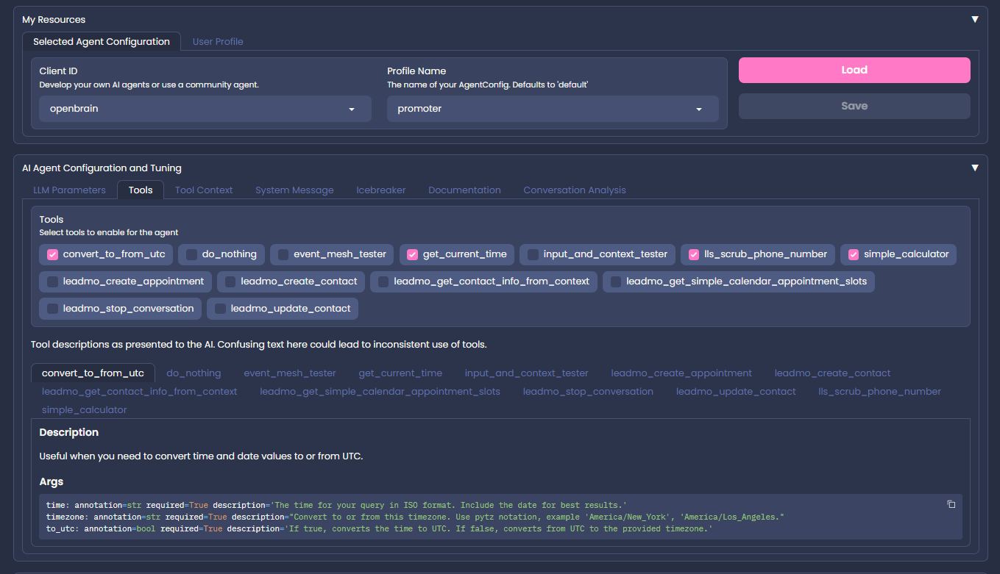

# OpenBrain


[](https://www.gnu.org/licenses/agpl-3.0)[](https://github.com/astral-sh/ruff)
<a href="https://github.com/psf/black"></a>
[](https://conventionalcommits.org)
[](https://github.com/pre-commit/pre-commit)
[](https://github.com/features/actions "Go to GitHub Actions homepage")
[](https://github.com/semantic-release/semantic-release)

## Links

- [AI Agent Tuner](https://tuner.openbra.in):

  - A Gradio interface to create, test, save, and load sets of agent configurations.
  - Agent configurations allows your API calls to start sessions with a specific agent configuration (i.e. lead-bot, cold-caller, x-bot, etc.).



- [Demo Deployed Agent Page](https://www.openbra.in):

  - An example page that's using the agent from the public demo API.
  - This page uses an identity registered with [OpenBrain Portal](https://portal.openbra.in).
  - This page is using the [OpenBrain API](https://api.openbra.in) API to interact with LLMs.
  - This page is configured to use the client id `openbrain` and the profile called `promoter`, but it can, of course, use any stored agent configuration. The site is sending messages like this
    ```json
    {
        "client_id": "openbrain",
        "profileName": "promoter",
        "message": "Hi, this is a message from the user talking through the website. I want to schedule an appointment or something."
    }


- [OpenBrain Portal](https://portal.openbra.in):

  - Sign up for OpenBra.in as a service. Get an API key and start using the API.
  - This method does not require you to use the library or to deploy any infrastructure. Just grab an API key, and you can simply start with `axios` or the `requests` library (or whatever your language provides for making HTTP requests).


## Openbrain as a Service

To test Openbrain as a service, do the following:

1. Register at [https://portal.openbra.in](https://portal.openbra.in).
2. Log in to the portal and subscribe to the Openbrain chat endpoint.
3. Navigate to your dashboard in the portal to find and use your API keys.

NOTE: There is currently no fee for using the service, but it's using my personal AWS and OpenAI accounts, so I'll pull the plug immediately if it becomes expensive.

- **Interactive Agent Tuner**: Integrates with deployable web interface `ob-tuner`.
- **Command-Line Interface**: Use `ob` for quick completions and `ob-chat` for an interactive session.
- **Flexible Configuration**: Customizable, persistent agent configurations.
- **Event-Driven Architecture**: Tools that operate on the real world send events to the event bus.

## AI Agent Tools

### Context

OpenBrain agents can use tools, and those tools get input rom 2 sources: the agent's input values, and input values from "context". The "context" is any undocumented key/value pair. This is done in order to allow the agent to call tools that require sensitive information that we don't want the AI to have access to.

```json
{
  "client_id": "me@email.com",    // OpenBrain parameter
  "reset": true,                  // OpenBrain parameter
  "message": "Do a barrel roll",  // OpenBrain parameter
  "email": "hotlead@public.com",  // context
  "firstName": "John",            // context
  "lastName": "Doe",              // context
  "phone": "555-555-5555"         // context
}
```

### Tools

OpenBrain tools are categorized into 2 types: information retrieval tools, and action tools. Information retrieval tools are tools that get information from a 3rd party service or library and make that information available to the AI. Action tools, on the other hand, are tools that perform an action, such as updating a CRM, sending an email, etc. These "action tools" all operate in the same way, by taking the agent's input and context as input, and returning a creating an event on the the event mesh.

Tools need adaptors, so even action tools need OpenBrain support in order to make the AI aware of what input parameters these action tools require. Information retrieval tools, on the other hand, can not be implemented trivially using an event mesh, as the AI needs to be aware of the information that was retrieved immediately, so these tools are implemented directly in openBrain.

#### Generic Tools

These tools are available to all agents. Each tool is listed by name with a brief description of its functionality, and lists the required context keys.

- **get_current_time**: Get the current time.
- **simple_calculator**: Perform a simple calculation.

#### 3rd party services

- **lls_scrub_phone_number**: Get DNC information for a phone number.
  - api_key (optional): The API key for the LLS service. If not provided, the default key will be used from AWS Secrets Manager.

#### CRM support for Lead Momentum

- **leadmo_update_contact**: Update a contact in Lead Momentum.
- **leadmo_stop_conversation**: Stop a conversation in Lead Momentum.
- **leadmo_create_contact**: Create a contact in Lead Momentum.
- **leadmo_delete_contact**: Delete a contact in Lead Momentum.
- **leadmo_get_contact_details_from_context**: Get contact details from this request's context to be made available to the AI.
- **leadmo_get_simple_calendar-appointment_slots**: Get available appointment slots from Lead Momentum.
- **leadmo_create_appointment**: Create an appointment in Lead Momentum.

## Architecture Overview

### Data Model


# Data Flow diagram

OpenBrain uses an event driven architecture. The agent sends events to event bus and then the developer can simply write rules and targets for the incoming events once the targets are ready. The following diagram shows the data flow in two parts.

1. The user interaction with the agent and the agent interaction with an event bus.
2. The event bus and the targets that are triggered by the events.


## Contributing

See [CONTRIBUTING.md](CONTRIBUTING.md) for guidelines.

## License

- **Open Source**: AGPLv3
- **Commercial**: See [COMMERCIAL_LICENSE](COMMERCIAL_LICENSE) and contact us for inquiries.
